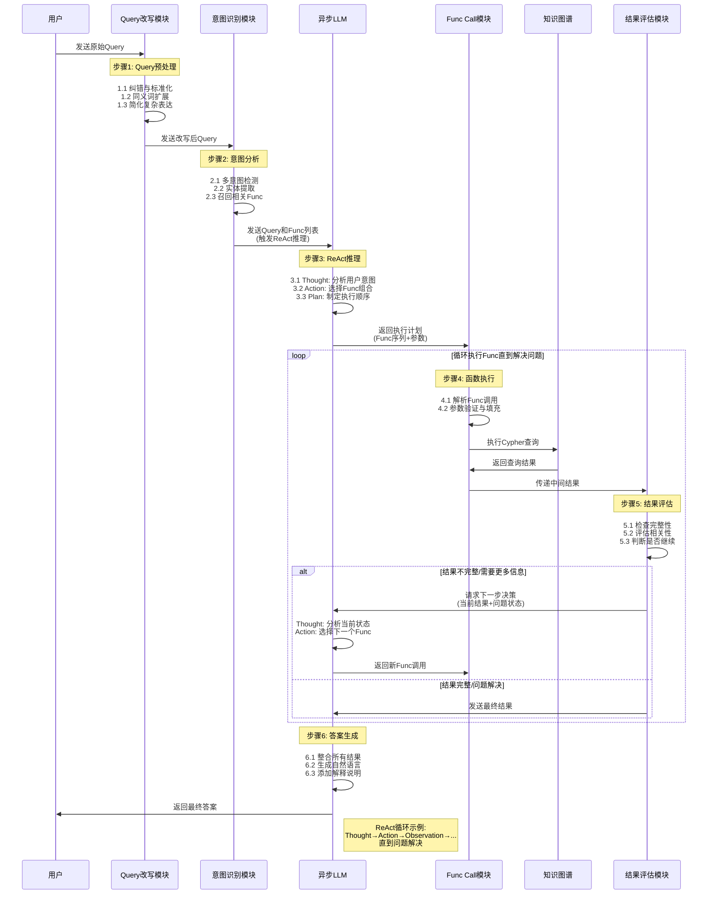

# RailMind

RailMind是一个基于LangChain构建的ReAct铁路运输场景下的问答系统

后续优化：Agent-RL训练、多智能体协作、更强大的记忆系统、与多数据库交互、抗并发等前沿Agent方法

# Framework

```mermaid
sequenceDiagram
    participant 用户
    participant Query改写模块
    participant 意图识别模块
    participant 异步LLM
    participant Func Call模块
    participant 知识图谱
    participant 结果评估模块

    用户->>Query改写模块: 发送原始Query
    
    Note over Query改写模块: 步骤1: Query预处理
    Query改写模块->>Query改写模块: 1.1 纠错与标准化<br/>1.2 同义词扩展<br/>1.3 简化复杂表达
    Query改写模块->>意图识别模块: 发送改写后Query
    
    Note over 意图识别模块: 步骤2: 意图分析
    意图识别模块->>意图识别模块: 2.1 多意图检测<br/>2.2 实体提取<br/>2.3 召回相关Func
    意图识别模块->>异步LLM: 发送Query和Func列表<br/>(触发ReAct推理)
    
    Note over 异步LLM: 步骤3: ReAct推理
    异步LLM->>异步LLM: 3.1 Thought: 分析用户意图<br/>3.2 Action: 选择Func组合<br/>3.3 Plan: 制定执行顺序
    异步LLM->>Func Call模块: 返回执行计划<br/>(Func序列+参数)
    
    loop 循环执行Func直到解决问题
        Note over Func Call模块: 步骤4: 函数执行
        Func Call模块->>Func Call模块: 4.1 解析Func调用<br/>4.2 参数验证与填充
        Func Call模块->>知识图谱: 执行Cypher查询
        
        知识图谱->>Func Call模块: 返回查询结果
        
        Func Call模块->>结果评估模块: 传递中间结果
        
        Note over 结果评估模块: 步骤5: 结果评估
        结果评估模块->>结果评估模块: 5.1 检查完整性<br/>5.2 评估相关性<br/>5.3 判断是否继续
        
        alt 结果不完整/需要更多信息
            结果评估模块->>异步LLM: 请求下一步决策<br/>(当前结果+问题状态)
            异步LLM->>异步LLM: Thought: 分析当前状态<br/>Action: 选择下一个Func
            异步LLM->>Func Call模块: 返回新Func调用
        else 结果完整/问题解决
            结果评估模块->>异步LLM: 发送最终结果
        end
    end
    
    Note over 异步LLM: 步骤6: 答案生成
    异步LLM->>异步LLM: 6.1 整合所有结果<br/>6.2 生成自然语言<br/>6.3 添加解释说明
    异步LLM->>用户: 返回最终答案
    
    Note right of 异步LLM: ReAct循环示例:<br/>Thought→Action→Observation→...<br/>直到问题解决
```

## 1. 各模块响应时间

```mermaid
gantt
    title 列车查询系统处理流程时间线
    dateFormat  HH:mm
    axisFormat %H:%M
    
    section 用户交互
    用户输入查询     :00:00, 10s
    显示结果        :00:20, 5s
    
    section 意图识别
    文本预处理      :00:02, 3s
    意图分类        :00:05, 5s
    参数提取        :00:10, 5s
    
    section 查询处理
    构建Cypher查询  :00:15, 8s
    执行数据库查询  :00:18, 7s
    
    section 结果处理
    数据格式化      :00:25, 5s
    计算处理        :00:27, 8s
    生成自然语言    :00:30, 10s
```

---