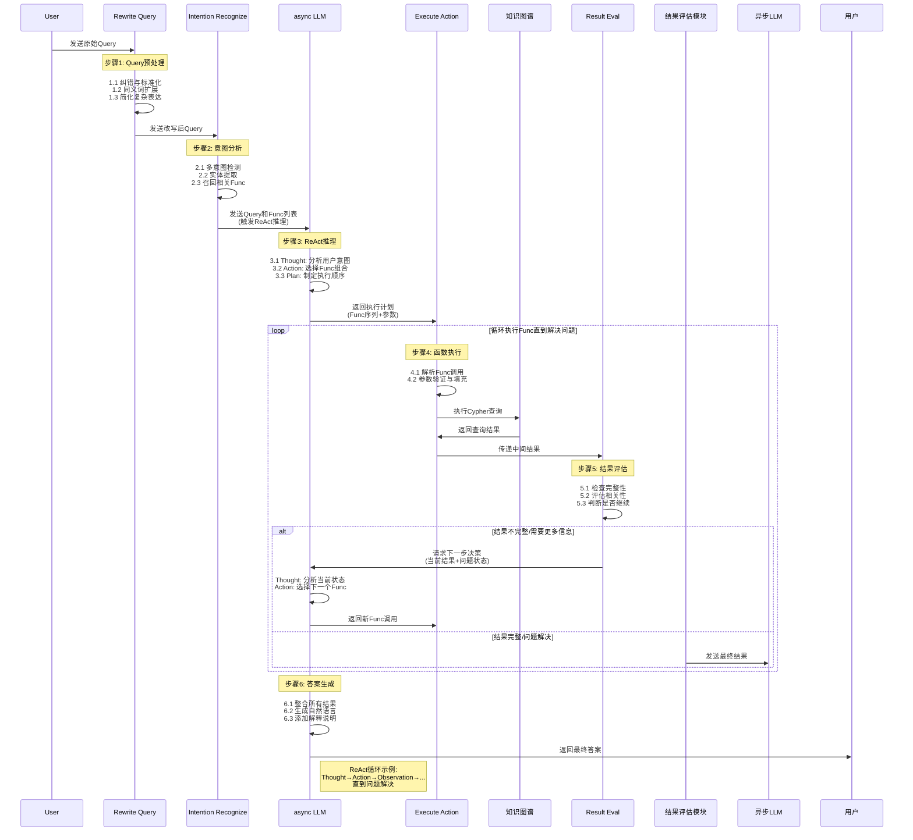
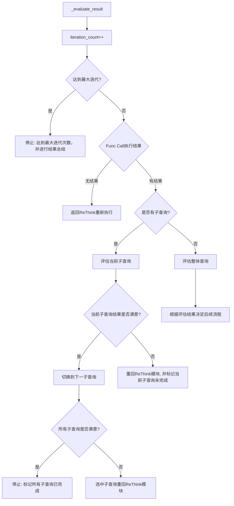

# RailMind

RailMind是一个基于LangChain构建的ReAct铁路运输场景下的问答系统

后续优化：Agent-RL训练、多智能体协作、更强大的记忆系统、与多数据库交互、抗并发等前沿Agent方法

# Framework

```mermaid
gantt
    title 列车查询系统处理流程时间线
    dateFormat  HH:mm
    axisFormat %H:%M
    
    section 用户交互
    用户输入查询     :00:00, 10s
    显示结果        :00:20, 5s
    
    section 意图识别
    文本预处理      :00:02, 3s
    意图分类        :00:05, 5s
    参数提取        :00:10, 5s
    
    section 查询处理
    构建Cypher查询  :00:15, 8s
    执行数据库查询  :00:18, 7s
    
    section 结果处理
    数据格式化      :00:25, 5s
    计算处理        :00:27, 8s
    生成自然语言    :00:30, 10s
```

---

## 1. 各模块拆解

### 1.3 各模块响应时间

### 1.2 IF LOOP

## 2. 遇到的挑战及解决方案

### 2.1 Query重写模块

### 2.2 意图识别模块

### 2.3 ReThink模块

### 2.4 Func Call 执行模块

### 2.5 完成度评估模块

### 2.6 Agent记忆问题

### 2.7 前端可视化